```mermaid
flowchart TD
    AI["Artificial Intelligence (AI)"]

    AI --> SAI["Symbolic AI"]
    AI --> CI["Computational Intelligence"]
    AI --> ML["Machine Learning"]
    AI --> DL["Deep Learning"]
    AI --> GAI["Generative AI"]
    AI --> NLP["Natural Language AI"]

    SAI --> S1["Expert Systems"]
    SAI --> S2["Knowledge Representation"]
    SAI --> S3["Logic Programming"]

    CI --> C1["Neural Networks"]
    CI --> C2["Genetic Algorithms"]
    CI --> C3["Fuzzy Logic"]
    CI --> C4["Swarm Intelligence"]

    ML --> M1["Supervised Learning"]
    ML --> M2["Unsupervised Learning"]
    ML --> M3["Semi-Supervised Learning"]
    ML --> M4["Reinforcement Learning"]

    DL --> D1["CNN"]
    DL --> D2["RNN / LSTM"]
    DL --> D3["Transformers"]
    DL --> D4["GANs"]

    GAI --> G1["LLMs"]
    GAI --> G2["Image Generation"]
    GAI --> G3["Video Generation"]
    GAI --> G4["Multimodal AI"]

    NLP --> N1["NLU"]
    NLP --> N2["NLG"]
    NLP --> N3["Machine Translation"]

```

<div align="center">


# **`Awesome`** Artificial Intelligence ([AI](https://wikipedia.org/wiki/Artificial_intelligence)) [](https://awesome.re)
</div>

[]()
[](https://www.reddit.com/r/ArtificialInteligence/new/)

<p align="center">
    <a href="https://github.com/cybersecurity-dev/"></a>
    &nbsp;
    <a href="https://www.youtube.com/@CyberThreatDefense"></a>
    &nbsp;
    <a href="https://cyberthreatdefence.com/my_awesome_lists"></a>
    
</p>

## 📖 Contents
- [My Awesome Lists](#my-awesome-lists)
- [Contributing](#contributing)
- [Contributors](#contributors)

```text
Artificial Intelligence (AI)
│
├─► Symbolic AI (Rule-Based AI)
│    │
│    ├─ Expert Systems
│    ├─ Knowledge Representation
│    ├─ Logic Programming
│    ├─ Ontologies
│    └─ Automated Reasoning
│
├─► Computational Intelligence
│    │
│    ├─ Neural Networks
│    ├─ Evolutionary Algorithms
│    ├─ Genetic Algorithms
│    ├─ Swarm Intelligence
│    └─ Fuzzy Logic
│
├─► Machine Learning (ML)
│    │
│    ├─ Supervised Learning
│    │    ├─ Classification
│    │    └─ Regression
│    │
│    ├─ Unsupervised Learning
│    │    ├─ Clustering
│    │    ├─ Dimensionality Reduction
│    │    └─ Association Mining
│    │
│    ├─ Semi-Supervised Learning
│    ├─ Self-Supervised Learning
│    └─ Reinforcement Learning
│
├─► Deep Learning (DL)
│    │
│    ├─ Feedforward Neural Networks
│    ├─ CNN (Computer Vision)
│    ├─ RNN / LSTM / GRU
│    ├─ Autoencoders
│    ├─ GANs
│    ├─ Transformers
│    └─ Foundation Models
│
├─► Generative AI
│    │
│    ├─ Large Language Models (LLMs)
│    ├─ Image Generation Models
│    ├─ Video Generation Models
│    ├─ Audio & Music Models
│    └─ Multimodal Models
│
├─► Natural Language AI
│    │
│    ├─ NLP
│    ├─ NLU
│    ├─ NLG
│    ├─ Machine Translation
│    ├─ Information Extraction
│    └─ Question Answering
│
├─► Perception AI
│    │
│    ├─ Computer Vision
│    ├─ Speech Recognition
│    ├─ Facial Recognition
│    ├─ Object Detection
│    └─ Image Segmentation
│
├─► Autonomous & Robotics AI
│    │
│    ├─ Robotics
│    ├─ Autonomous Vehicles
│    ├─ Path Planning
│    ├─ Control Systems
│    └─ Multi-Agent Systems
│
└─► Emerging AI Areas
     │
     ├─ Explainable AI (XAI)
     ├─ Trustworthy AI
     ├─ Responsible AI
     ├─ Edge AI
     ├─ Neuro-Symbolic AI
     ├─ Causal AI
     └─ Artificial General Intelligence (AGI)
```

##

### My Awesome Lists
You can access the my awesome lists [here](https://cyberthreatdefence.com/my_awesome_lists)

### Contributing
[Contributions of any kind welcome, just follow the guidelines](contributing.md)!

### Contributors
[Thanks goes to these contributors](https://github.com/cybersecurity-dev/awesome-artificial-intelligence/graphs/contributors)!

### License
[](http://creativecommons.org/publicdomain/zero/1.0)

[🔼 Back to top](#awesome-artificial-intelligence-ai-)
